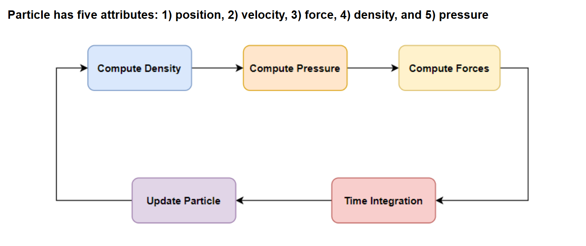
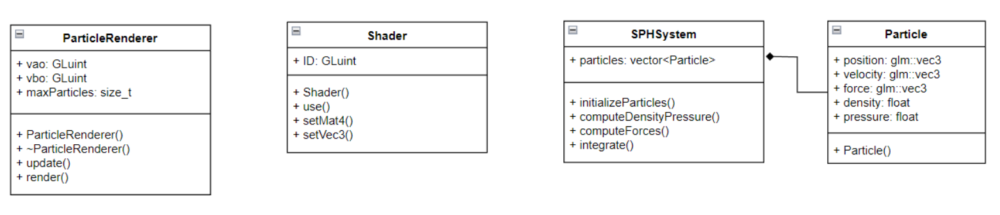

## Contribution:
- Beomseok Park.: Implement both a CPU-based SPH simulation and a GPU-based SPH simulation.
- Shutong Peng: Implement Particle Shader
- A detailed walkthrough is provided in my blog:
https://baampark.github.io/posts/2025-04-06_sph/

## Simulation Flow and Data Structure




## Performance
| Approach | # Particles | Average Time (sec) | Total Time (sec) |
|----------|-------------|--------------------|------------------|
| CPU      | 125         | 0.004              | 4.161            |
| **CUDA** | **125**     | **0.0014**         | **1.471**        |
| CPU      | 1,000       | 0.169              | 169.067          |
| **CUDA** | **1,000**   | **0.0017**         | **1.742**        |


```bash
g++ main.cpp ParticleRenderer.cpp SPHSystem.cpp shader.cpp -o fluid_sim -lGL -lGLEW -lglfw
```


```bash
nvcc -arch=sm_86 -std=c++17 \
     Shader.cpp ParticleRenderer.cpp main_cuda.cpp SPHSystemCUDA.cu \
     -lglfw -lGLEW -lGL -o fluid_sim_cuda


nvcc -arch=sm_86 -std=c++17 \
     Shader.cpp ParticleRenderer.cpp main_shared_cuda.cpp SPHSystemSharedCUDA.cu \
     -lglfw -lGLEW -lGL -o fluid_sim_shared_cuda
```

## Note:
- The GPU-based SPH simulation uses CUDA global memory only.
- We implement SPHsystem using CUDA shared memory however, we haven't found performance boost compared to CUDA global memory one.